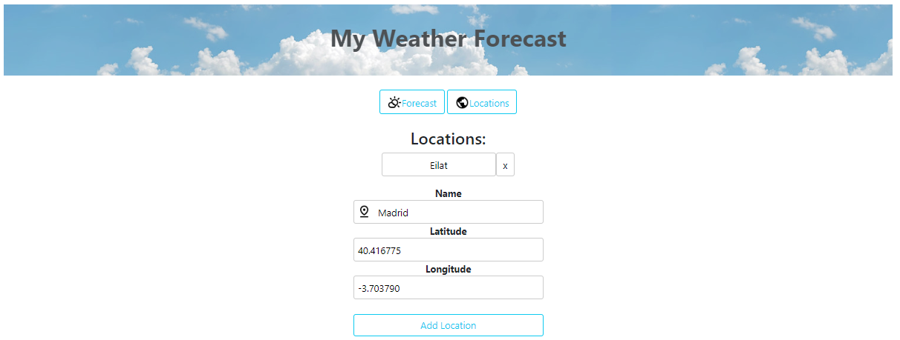
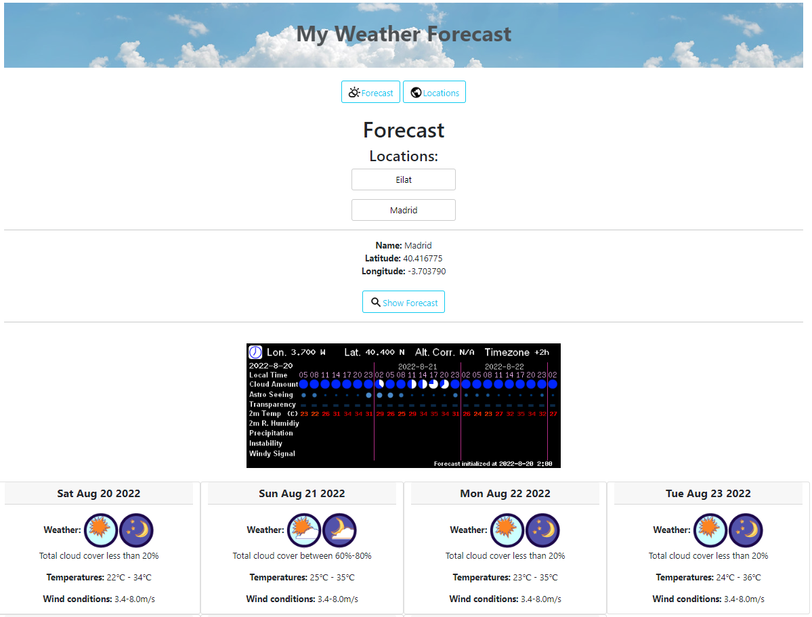

# React Weather App
 
## Authors
* [Shaked Vaknin](https://github.com/shakedva)
* [Noy Tal Gelfand](https://github.com/noytal1)

## General Information

A React SPA for displaying weather using the library react-router.  
In this page the user can do 2 things: 

* Add/Remove location to/from a user-defined list by choosing its name, latitude and longitude.
* Choose a specific location in their list and load it's forecast for the following week.

### Assumptions
The latitude values are between -90 - 90.  
The longitude  values are between -180 - 180.  
If the values entered are too close to the edges (like longitude=179.9)
you might receive invalid  information or might not receive at all.

## Screenshots

